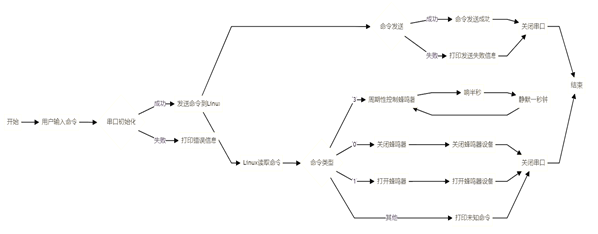

成绩	
                             
南京工程学院
课程设计说明书(论文)

题       目    通过串口控制开发板载蜂鸣器的开关                         

        
课 程 名 称         嵌入式软件设计           
院（系、部、中心）    计算机工程学院        
专      业          计算机科学与技术      
班       级            计算机212           
学 生 姓 名              戴阳               
学 生 学 号           202210216             
设 计 地 点             信息楼A110         
指 导 教 师               曹欲晓           


设计起止时间：2024年5月27日至2024年5月31日
      
# 通过串口控制开发板载蜂鸣器的开关
### 一、课程设计目的及意义
本课程设计是为配合《嵌入式软件设计》课程的学习而设立的，通过本课程设计，可使学生更加深刻地理解《嵌入式软件设计》课程讲述的内容；培养学生独立思考、解决实际工程问题的能力；提高学生设计、实现、调试、测试嵌入式软件的能力。
### 二、设计任务
1.程序在开发板上运行，程序启动之后，首先按照固定的时间间隔控制板载蜂鸣器周期性的响和停（比如，响半秒钟，然后静默一秒钟，如此循环）。
2．开发板程序作为串口的Server端，接收Client的请求。
3.Client运行在PC上（Linux或者Windows均可），Client随时可以接受用户的输入时间周期，对用户输入的合法性进行检查后，通过串口发送给Server。
4.Server接收到Client的请求，分析Client的命令并执行。
5.命令的内容包括蜂鸣器的常响、关掉、周期响和静默（周期由用户指定），命令的格式自行定义。要求Server要对命令的合法性进行检查。
### 三、主要技术指标和要求
① 掌握Linux系统使用的能力；
② 掌握vi编辑器、gcc编译器、gdb调试器的使用，学会makefile的编写；
③ 掌握交叉编译、交叉调试的方法，并会应用多种手段把嵌入式程序下载到开发板并使之运行的能力；
④ 掌握一定的程序调试技能；
⑤ 撰写规范的设计总结报告，培养严谨的作风和科学的态度。  

课程设计要求使用C/C++、Shell编写程序，使用ARM gcc交叉编译器进行编译。编写的程序能在iTOP-4412开发板上正确运行。（算法及功能调试阶段可以在PC机上的Linux环境下进行）
编写的程序，要求功能正确、完善，考虑到各种异常及边界情况，力争向“工业级代码”看齐，而不是简单的“学生代码”。
要求变量命名准确、规范；代码排版清晰、层次结构清楚；争取使用git等版本控制工具
### 四、设计流程及设计思想说明
1．框图
各模块说明：
- 用户输入命令:用户在Windows客户端输入命令字符（'0', '1', '3'）。
- 串口初始化:在Windows客户端，根据预设的COM端口和波特率初始化串口。在Linux服务器端，打开串口设备，并配置串口参数。
- 发送命令到Linux:Windows客户端将用户输入的命令发送到Linux服务器。
- 命令发送:Linux服务器端从串口读取命令。
- 命令类型:根据读取到的命令字符，Linux服务器端执行相应的操作。
- 关闭/打开蜂鸣器:对应命令'0'或'1'，Linux服务器端调用controlBuzzer函数，通过ioctl系统调用控制蜂鸣器的开关。
- 周期性控制蜂鸣器:对应命令'3'，Linux服务器端先打开蜂鸣器响半秒，然后关闭蜂鸣器静默一秒钟，如此循环。
- 打印信息:在命令发送成功或失败时，Windows客户端打印相应的信息。在Linux服务器端，根据命令执行结果打印信息或未知命令提示。
- 关闭串口:在命令处理完成后，无论是Windows客户端还是Linux服务器端，都需要关闭串口以释放资源。
- 参数设置说明：
Windows客户端串口初始化参数:
com: COM端口编号。
115200: 波特率。
8: 数据位。
ONESTOPBIT: 停止位（无额外参数，表示1个停止位）。
NOPARITY: 校验位（无额外参数，表示无校验）。
- Linux服务器端串口配置参数:
B115200: 设置输入输出波特率为115200。
CS8: 设置为8数据位。
PARENB, CSTOPB, CSIZE: 清除相关标志位，以配置数据位、停止位和校验位。
IXON, IXOFF, IXANY: 禁用软件流控制。
INLCR, ICRNL, IGNCR, ICRNL: 设置输入处理标志。
ICANON, ECHO, ECHOE, ISIG: 设置本地模式和回显模式。
OPOST: 禁用输出处理。
- 蜂鸣器控制参数:
BUZZER_ON: 打开蜂鸣器。
BUZZER_OFF: 关闭蜂鸣器。
usleep(500000): 蜂鸣器响半秒。
usleep(1000000): 蜂鸣器静默一秒。
2．子模块设计 
用户输入模块: 在Windows客户端，负责接收用户输入的命令，并验证命令的有效性。
串口通信模块: 在Windows客户端负责初始化串口，发送数据到Linux服务器；在Linux服务器端负责打开串口，配置串口参数，读取串口数据。
命令解析模块: 在Linux服务器端，根据从串口读取到的数据执行相应的命令。
蜂鸣器控制模块: 在Linux服务器端，根据接收到的命令控制蜂鸣器的开关和周期性响。
错误处理模块: 在串口初始化和配置过程中，如果遇到错误，打印错误信息并退出程序。
### 五、程序清单
PC机端代码
```
#include <stdio.h>
#include <string.h>
#include <windows.h>
#include "serial.h"
int com = 6;
// 函数声明
int sendCommandToLinux(int command, PORT com_port);
int main() {
    while (1) {
        char command;
        printf("请输入命令: ");
        // 使用 %c 前要加空格以忽略前一个输入的换行符
        scanf_s("%c", &command);
        printf("输入的命令为: %c\n", command);
        // 检查命令是否为有效字符
        if (command != '1' && command != '0' && command != '3') {
            printf("无效命令，请输入 1, 0 或 3\n");
            continue; // 跳过此循环迭代
        }
        printf("启动\n");
        // 初始化串口
        PORT com_port = serial_init(com, 115200, 8, ONESTOPBIT, NOPARITY);
        if (com_port == NULL) {
            printf("Failed to open serial port.\n");
            return 1;
        }
        printf("准备发送\n");
        // 发送命令
        int ret = sendCommandToLinux(command, com_port);
        if (ret != 0) {
            printf("Failed to send command to Linux board.\n");
        }
        else {
            printf("Command sent successfully.\n");
        }
        // 关闭串口
        ClosePort(com_port);
    }
    return 0;
}
```
开发板端代码
```
#include <stdio.h>
#include <stdlib.h>
#include <string.h>
#include <fcntl.h>
#include <unistd.h>
#include <termios.h>
#include <sys/ioctl.h>
#define BUZZER_CTL "/dev/buzzer_ctl"
#define BUZZER_ON 1
#define BUZZER_OFF 0
// 控制蜂鸣器的函数
void controlBuzzer(int cmd) {
    int fd, ret;
    // 打开蜂鸣器设备
    if ((fd = open(BUZZER_CTL, O_RDWR | O_NOCTTY | O_NDELAY)) < 0) {
        printf("打开蜂鸣器设备失败！\n");
        return;
    }
    // 发送控制命令
    ret = ioctl(fd, cmd, 1);
    close(fd); // 关闭设备
}
int main() {
    int fd;
    struct termios config;
    // 打开串口设备
    fd = open("/dev/ttySAC2", O_RDWR | O_NOCTTY);
    if (fd < 0) {
        perror("打开串口设备出错");
        return 1;
    }
    // 配置串口
    memset(&config, 0, sizeof(config));
    if (tcgetattr(fd, &config) < 0) {
        perror("获取串口属性出错");
        close(fd);
        return 1;
    }
    // 设置波特率为115200
    cfsetispeed(&config, B115200);
    cfsetospeed(&config, B115200);
    // 8数据位，无校验
    config.c_cflag &= ~PARENB;
    config.c_cflag &= ~CSTOPB;
    config.c_cflag &= ~CSIZE;
    config.c_cflag |= CS8;
    // 禁用流控制
    config.c_iflag &= ~(IXON | IXOFF | IXANY);
    config.c_iflag &= ~(INLCR | ICRNL);
    config.c_iflag &= ~(IGNCR | ICRNL);
    // 设置为原始模式
    config.c_lflag &= ~(ICANON | ECHO | ECHOE | ISIG);
    // 禁用输出处理
    config.c_oflag &= ~OPOST;
    // 应用新的串口设置
    if (tcsetattr(fd, TCSANOW, &config) < 0) {
        perror("设置串口属性出错");
        close(fd);
        return 1;
    }
    char cmd;
    while (1) {
        // 从串口读取数据
        if (read(fd, &cmd, sizeof(cmd)) > 0) {
            switch (cmd) {
                case '0': // 关闭蜂鸣器
                    controlBuzzer(BUZZER_OFF);
                    printf("关闭蜂鸣器。\n");
                    break;
                case '1': // 打开蜂鸣器
                    controlBuzzer(BUZZER_ON);
                    printf("打开蜂鸣器。\n");
                    break;
                case '3': // 周期性响
                    controlBuzzer(BUZZER_ON);
                    usleep(500000); // 响半秒钟
                    controlBuzzer(BUZZER_OFF);
                    usleep(1000000); // 静默一秒钟
                    break;
                default:
                    printf("未知命令：%c\n", cmd);
            }
        }
    }
    // 关闭串口
    close(fd);
    return 0;
}
// 函数：向 Linux 板发送命令
int sendCommandToLinux(char command, PORT com_port) {
    char buffer[1];
    buffer[0] = command;
    int bytes_sent = SendData(com_port, buffer, 1);
    if (bytes_sent <= 0) {
        printf("Failed to send command.\n");
        return 1;
    }
    return 0;
}
```

### 六、程序交叉编译、下载及调试步骤
开发板程序编译
在终端输入命令vi aa.c（开发板c程序）
gcc -o aa aa.c编译
./aa 执行
PC机代码在电脑编译器如vscode上运行
### 七、程序运行结果截图及性能分析

### 八、课程设计的收获和体会
在本次课程设计中，我深刻体会到了将理论知识应用于实际项目的重要性，同时也锻炼了我的问题解决能力和团队协作精神。通过开发一个跨平台的串口通信系统来控制蜂鸣器，我不仅提升了编程技能，还学会了如何规划和管理项目。测试结果表明，我们的程序能够稳定运行并满足任务要求，展示了良好的实时响应能力和模块化设计。然而，我也意识到程序在错误处理、用户界面友好性以及扩展性方面还有待改进。未来，我计划通过增加错误检测、开发图形用户界面、引入配置文件管理以及实现日志系统等措施来增强程序的健壮性、易用性和灵活性。

### 九、参考文献（含网络资源）
[01] 华清远见嵌入式培训中心.嵌入式Linux应用程序开发标准教程（第2版）[M].人民邮电出版社，2009.
[02] 北京讯为电子有限公司.iTOP-4112开发板之精英版使用手册[M].北京讯为电子有限公司，2016.


成绩评定：
态度和纪律	实际动手能力	创新能力	报    告	综合成绩
优秀	优秀	优秀	优秀	优秀
良好	良好	良好	良好	良好
中等	中等	中等	中等	中等
及格	及格	及格	及格	及格
不及格	不及格	不及格	不及格	不及格


评语：


